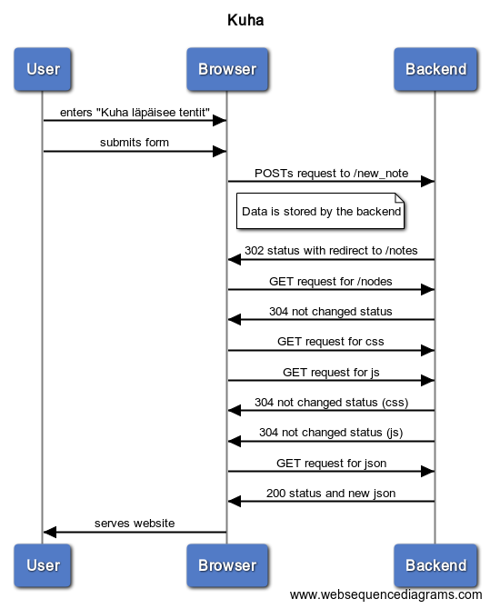

# Sequence diagrams

## /notes

Note that the sequence diagram doesn't properly convey the asyncronous nature of the transaction. In actuality the entirety of the html file for example is received only after the requests for the .css and the .js files are sent. This convays only the dependance of the action sequence

Events for user submitting the note "Kuha läpäisee tentit":

<!--
title Kuha

User->Browser: enters "Kuha läpäisee tentit"
User->Browser: submits form
Browser->Backend: POSTs request to /new_note
note right of Browser: Data is stored by the backend
Backend->Browser: 302 status with redirect to /notes
Browser->Backend: GET request for /nodes
Backend->Browser: 304 not changed status
Browser->Backend: GET request for css
Browser->Backend: GET request for js
Backend->Browser: 304 not changed status (css)
Backend->Browser: 304 not changed status (js)
Browser->Backend: GET request for json
Backend->Browser: 200 status and new json
Browser->User: serves website
-->

## /spa

Events for user navigating to /spa

<!--
title SPA

User->Browser: presses CTRL + F5
Browser->Backend: GET request to /spa
Backend->Browser: 200 status and .html
Browser->Backend: GET request for /main.css
Browser->Backend: GET request for /spa.js
Backend->Browser: 200 status and css
Backend->Browser: 200 status and js
Browser->Backend: GET request for /data.json
Browser->Backend: GET request for /favicon.ico
Backend->Browser: 200 status and json
Backend->Browser: 404 status
Browser->User: serves website
-->

## /spa 2

Events for user submitting the note "Ei tartte voimaa lukee"

<!--
title SPA post

User->Browser: Enters "Ei tartte voimaa lukee"
User->Browser: Submits form
Browser->Backend: POST request to /new_note_spa
note right of Browser: Data is stored by the backend
Backend->Browser: 201 status
Browser->User: serves website
-->
