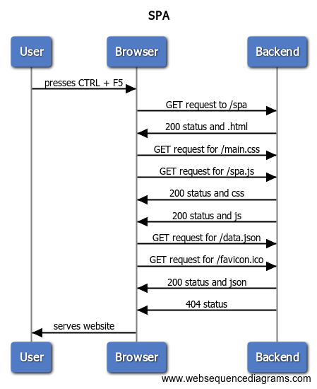

# Sequence diagrams

## /notes

Note that the sequence diagram doesn't properly convey the asyncronous nature of the transaction. In actuality the entirety of the html file for example is received only after the requests for the .css and the .js files are sent. This convays only the dependance of the action sequence

## /notes 2

As previously there is som asyncronicity in the requests that is omitted form the sequence diagram.

## /spa

## /spa 2

